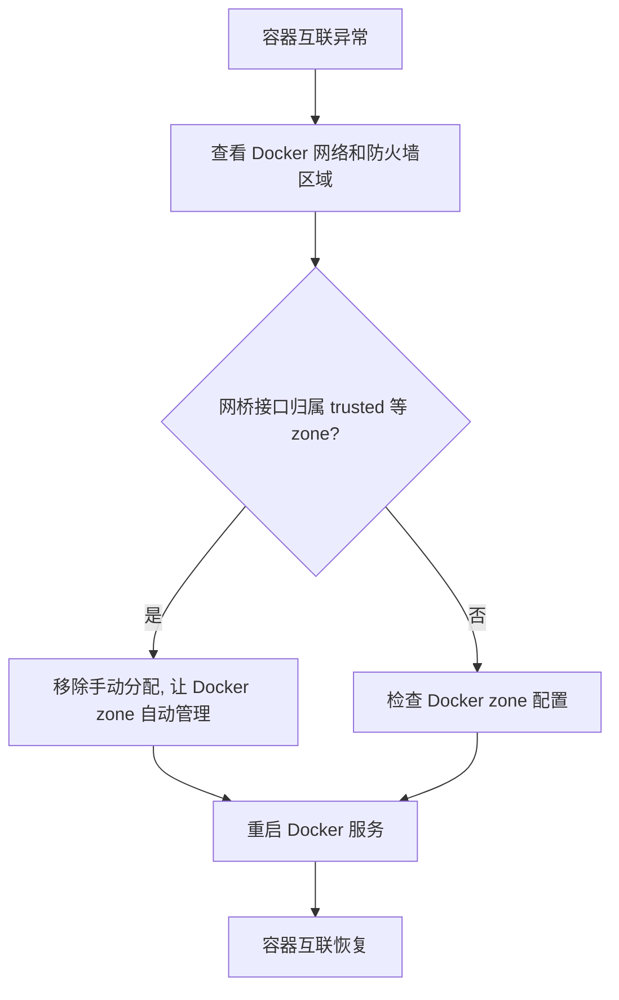

在 Fedora 42 及更高版本，系统默认使用 **nftables** 作为防火墙后端，**firewalld** 用于区域管理。Docker 部署后，容器间网络通信依赖于主机的防火墙规则。最近一次实战中，容器间网络通信出现了完全阻断，经历了多轮排查和配置，最终定位到 firewalld 区域和 Docker 的管理冲突。本文将完整记录排查和解决过程，并附上每一步关键命令及解释。

---

## 1. 问题发现：容器无法互连

首先，发现在 Docker 自定义网络 `1panel-network` 下，不同容器（如 Redis、Cloudreve 等）无法互相 ping 通：

```sh
docker run --rm -it --network=1panel-network busybox sh
ping 1Panel-redis-XuzC
```
> 结果：100% packet loss

---

## 2. 查看网络与区域归属

确认所有容器都已正确加入 Docker 网络：

```sh
docker network inspect 1panel-network
```
> 用途：查看网络内的所有容器及分配的 IP。

查看主机所有接口的防火墙区域归属：

```sh
sudo firewall-cmd --get-active-zones
```
> 用途：显示每个网络接口归属于哪个 firewalld 区域。

---

## 3. 初步尝试：修改区域规则

尝试将 Docker 网桥接口（如 `docker0`）加入全放行的 trusted 区域：

```sh
sudo firewall-cmd --zone=trusted --add-interface=docker0 --permanent
sudo firewall-cmd --reload
```
> 用途：让 docker0 网桥流量不受防火墙限制。

---

## 4. 新问题：Docker 无法启动

重启 Docker 服务时遇到启动失败：

```sh
sudo systemctl restart docker
sudo systemctl status docker
sudo journalctl -xeu docker.service | tail -n 50
```
> 用途：查看 Docker 服务状态和详细启动日志。

日志报错：
```
Error initializing network controller: error creating default "bridge" network: ZONE_CONFLICT: 'docker0' already bound to 'trusted'
```
> 说明：手动分配区域导致 Docker 自动管理冲突。

---

## 5. 恢复区域归属

移除手动分配，恢复 Docker 默认的区域管理：

```sh
sudo firewall-cmd --zone=trusted --remove-interface=docker0 --permanent
sudo firewall-cmd --reload
sudo systemctl restart docker
```
> 用途：让 Docker 能自动将网桥接口归属到 `docker` zone。

再次查看区域：

```sh
sudo firewall-cmd --get-active-zones
```
> 可见：`docker0`、`br-xxxxxx` 等接口已自动归属 docker zone。

---

## 6. 问题解决：让 Docker 自主管理区域

让 Docker 自主管理区域后，容器间网络通信随即恢复正常，无需手动干预防火墙规则。此时，所有 Docker 相关网桥接口（如 `docker0`、`br-xxxxxx`、`docker_gwbridge`）均自动归属 `docker` 区域，由 Docker 服务启动时自动分配和管理。

---

## 7. 实战总结与最佳实践

**（1）切勿手动分配 Docker 网桥到 firewalld 其他 zone**
Docker 启动会自动管理其网桥接口的区域归属。如果手动分配到 `trusted`、`FedoraWorkstation` 等 zone，会导致 ZONE_CONFLICT 报错，Docker 服务无法启动。

**（2）防火墙规则优化建议**
如需放行容器端口，对外暴露服务端口时，建议在 `docker` zone 进行端口开放。例如：

```sh
sudo firewall-cmd --zone=docker --add-port=6379/tcp --permanent
sudo firewall-cmd --reload
```

**（3）多桥网络场景**
如有自定义网络（如 `br-xxxxxx`），同样让 Docker 自动管理，无需人工干预。可用如下命令检查所有归属：

```sh
sudo firewall-cmd --get-active-zones
```
若发现 Docker 网桥未归属于 docker zone，优先排查 Docker 启动日志和 firewalld 配置。

---

## 8. 常见问题速查

- **容器互 ping 失败但主机映射端口可访问？**
  首查防火墙 zone 分配和规则，确认 Docker zone自动归属。
- **Docker 启动报 ZONE_CONFLICT？**
  立即移除手动绑定，恢复自动管理。
- **多网卡/虚拟网卡场景（如 zerotier、libvirt）**
  建议分别分配到合适 zone，避免与 Docker zone 冲突。

---

## 9. 总结流程图



---

## 10. 建议与经验

- Fedora 42 以后，**nftables + firewalld + Docker zone** 是容器网络安全的标准方案。
- 遇到网络问题，首查 zone 归属和 Docker 日志，少走弯路。
- 如有复杂多网桥、虚拟化环境，建议梳理所有接口的归属，分类管理，避免 zone 冲突。

---

## 参考命令速查表

| 操作             | 命令                                                           |             |
| -------------- | ------------------------------------------------------------ | ----------- |
| 查看网络接口归属       | `sudo firewall-cmd --get-active-zones`                       |             |
| 查看 Docker 网络   | `docker network inspect <网络名>`                               |             |
| 移除接口手动分配       | `sudo firewall-cmd --zone=<zone> --remove-interface=<iface>` |             |
| 重载防火墙          | `sudo firewall-cmd --reload`                                 |             |
| 重启 Docker 服务   | `sudo systemctl restart docker`                              |             |
| 查看 Docker 启动日志 | `sudo journalctl -xeu docker.service`                        | tail -n 50` |
